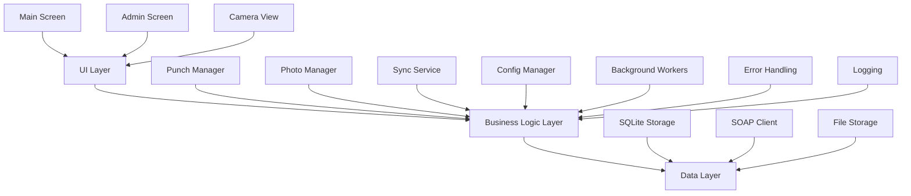
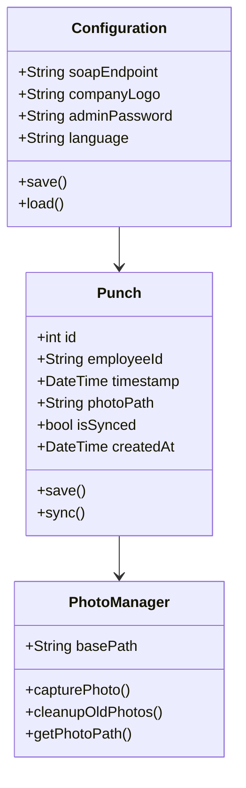

# MSIClock-Tablet Implementation Plan

## 1. System Architecture

The application follows a layered architecture pattern with clear separation of concerns:

### Architecture Diagram

## 2. Data Models

### Class Diagram

## 3. Key Components

### 3.1 UI Components

- **MainScreen (Kiosk Interface)**
  - Time display
  - Language selector
  - Company logo
  - ID entry field
  - Numeric keypad
  - Status indicators
  - Button to enter Admin Mode
  - Version Number
- **PunchScreen (Interface to Punch In)**
  - First and Last Name
  - ID Number
  - Last Punch Information
  - Time Display
  - 4 Buttons in Grid: Clock In, Clock Out, Start Lunch, End Lunch
  - Language Selector
  - Front Camera Preview (clicking any of the buttons will capture the image with no flash)
- **AdminScreen (Configuration)**
  - SOAP endpoint configuration
    - Client ID
    - Username
    - Password
  - Password management
    - Change admin password
  - Storage Configuration
    - How long to keep data and images on punch
  - Language settings
  - Read Current Logs
  - Close Program
- **LanguageSelector**
  - English/Spanish toggle
- **NumericKeypad**
  - Custom secure input
- **StatusIndicator**
  - Online/Offline status
  - Sync status

### 3.2 Services

- **PunchManager**
  - Handle punch logic
  - Validate employee IDs
  - Coordinate photo capture
- **SyncService**
  - SOAP communication
  - Retry logic
  - Queue management
- **PhotoManager**
  - Camera control
  - Photo storage
  - Cleanup routine
- **ConfigurationManager**
  - Settings storage
  - Password validation
- **BackgroundWorker**
  - Sync scheduling
  - Photo cleanup
  - Health checks

## 4. Implementation Phases

### Phase 1: Core Infrastructure

1. **Project Setup**
   - Flutter project initialization
   - Directory structure
   - Dependencies configuration
   - Git setup
2. **Basic UI Shell**
   - Kiosk mode implementation
   - Navigation blocking
   - Screen wake lock
3. **SQLite Integration**
   - Schema definition
   - Migration system
   - CRUD operations
4. **Configuration System**
   - Local storage
   - Default settings
   - Admin access

### Phase 2: Core Features

1. **Employee Punch Workflow**
   - ID entry validation
   - Punch type detection
   - Success/failure handling
2. **Camera Integration**
   - Front camera access
   - Photo capture
   - Image optimization
3. **Local Storage**
   - Punch records
   - Photo files
   - Configuration data
4. **Error Handling**
   - Exception catching
   - User feedback
   - Recovery procedures

### Phase 3: Network & Sync

1. **SOAP Integration**
   - Client implementation
   - Request/response handling
   - Error management
2. **Background Sync**
   - Worker implementation
   - Queue processing
   - Retry mechanism
3. **Offline Mode**
   - Connection detection
   - Data caching
   - Sync prioritization
4. **Recovery Logic**
   - Failed upload handling
   - Data consistency
   - Auto-recovery

### Phase 4: Admin & Security

1. **Admin Interface**
   - Password protection
   - Configuration UI
   - Diagnostic tools
2. **Security Hardening**
   - Access control
3. **Language Support**
   - Translation system
   - UI adaptation
   - RTL support
4. **Remote Access**
   - AnyDesk integration
   - Log access
   - Remote configuration
5. **Daily Logs**
   - Sent via email to a specific account set in Admin Settings
   - Able to turn this feature off in Admin Settings
   - Exception Reports sent when a punch fails

### Phase 5: Polish & Testing

1. **UI/UX Refinement**
   - Animation polish
   - Error messages
   - Loading states
2. **Performance**
   - Memory optimization
   - Battery efficiency
   - Storage management
3. **Testing**
   - Unit tests
   - Integration tests
   - Stress testing
4. **Documentation**
   - Code documentation
   - User manual
   - Admin guide

## 5. Security Considerations

### 5.1 Kiosk Mode Security

- System navigation disabled
- App switching prevented
- System dialog handling
- Screen always-on management
- Touch gesture restrictions

### 5.2 Data Security

- SQLite encryption
- Secure configuration storage
- Photo access control
- Network security (TLS)
- Password hashing (only the administrator password should be hashed)

## 6. Testing Strategy

### 6.1 Unit Tests

- Model validation
- Business logic
- SOAP integration
- Configuration management
- Error handling

### 6.2 Integration Tests

- Complete punch workflow
- Online/offline transitions
- Background operations
- Photo management
- Configuration changes

### 6.3 Stress Tests

- Extended runtime
- Network interruption
- Memory management
- Background task reliability
- Concurrent operations

## 7. Error Handling & Recovery

### 7.1 Error Categories

- Network connectivity
- Camera system
- Storage capacity
- API communication
- Configuration issues

### 7.2 Recovery Strategies

- Automatic retry logic
- Data consistency checks
- Graceful degradation
- Self-healing procedures
- User notification

## 8. Monitoring & Maintenance

### 8.1 Logging Strategy

- There should be different levels of logging from the most detailed to the normal day-to-day logging
- Error tracking
- Activity monitoring
- Performance metrics
- Sync status
- System health

### 8.2 Remote Support

- AnyDesk integration
- Log access
- Remote configuration
- Diagnostic tools
- Support procedures

## Next Steps

1. Initialize Flutter project with required dependencies
2. Set up basic kiosk mode functionality
3. Implement SQLite database schema
4. Create core UI components
5. Begin SOAP integration development

This plan will be updated as development progresses and new requirements or challenges are identified.
