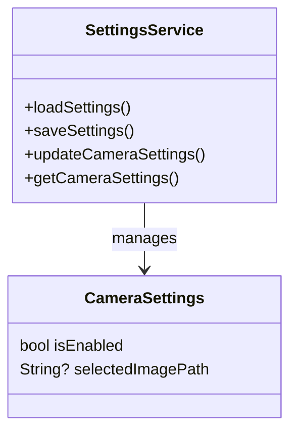
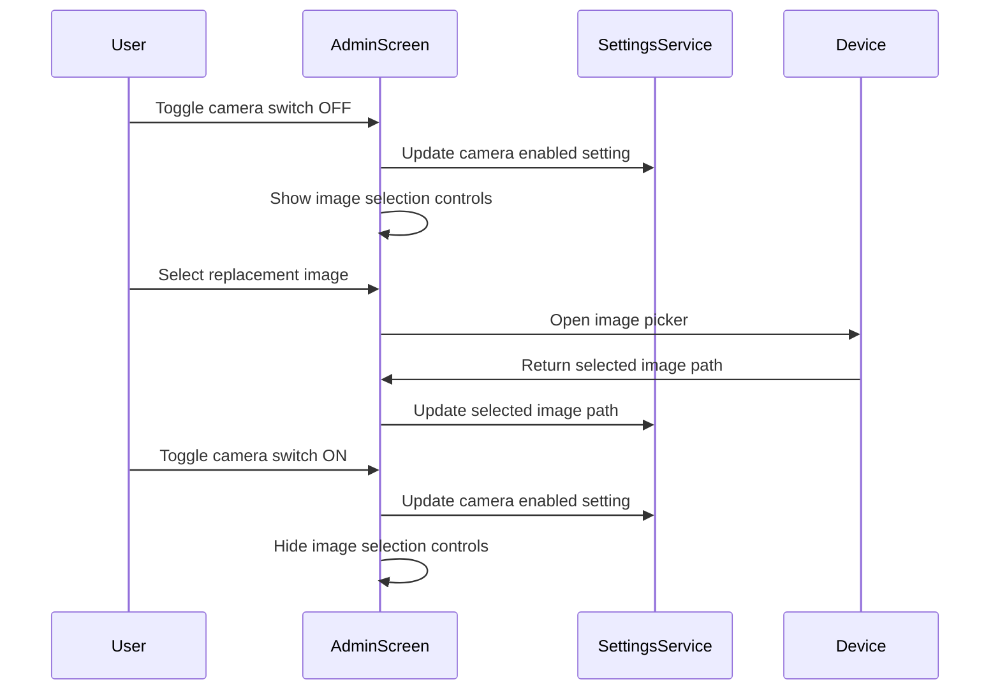
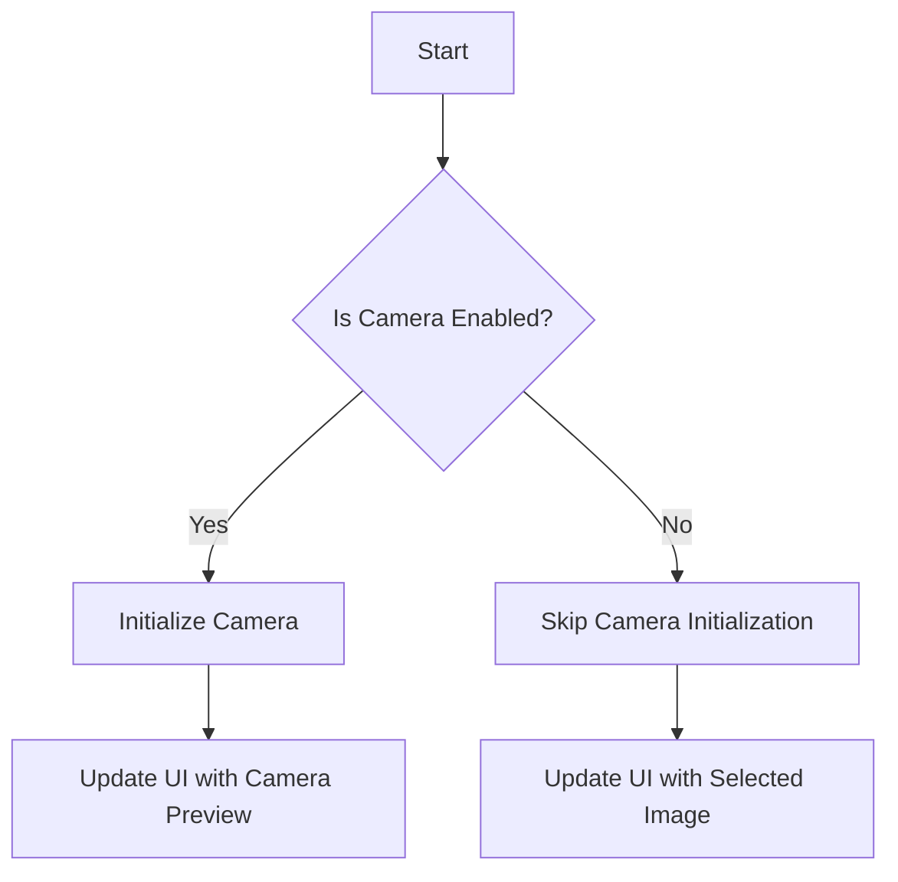
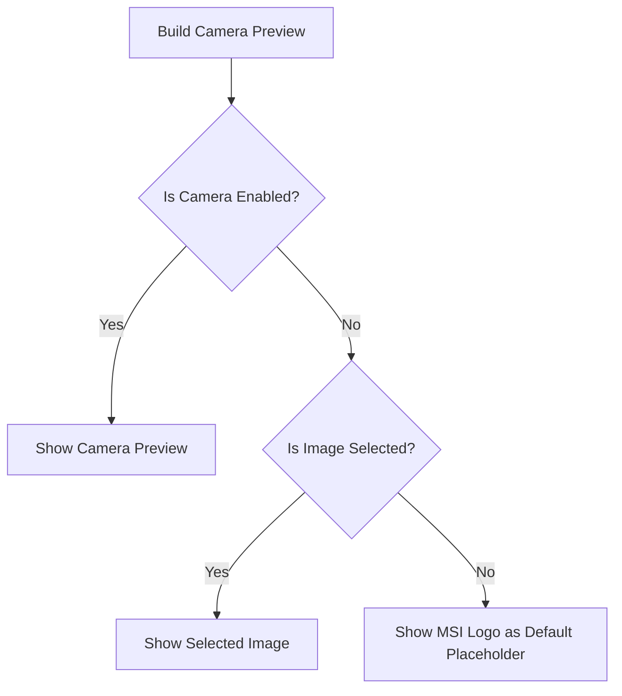
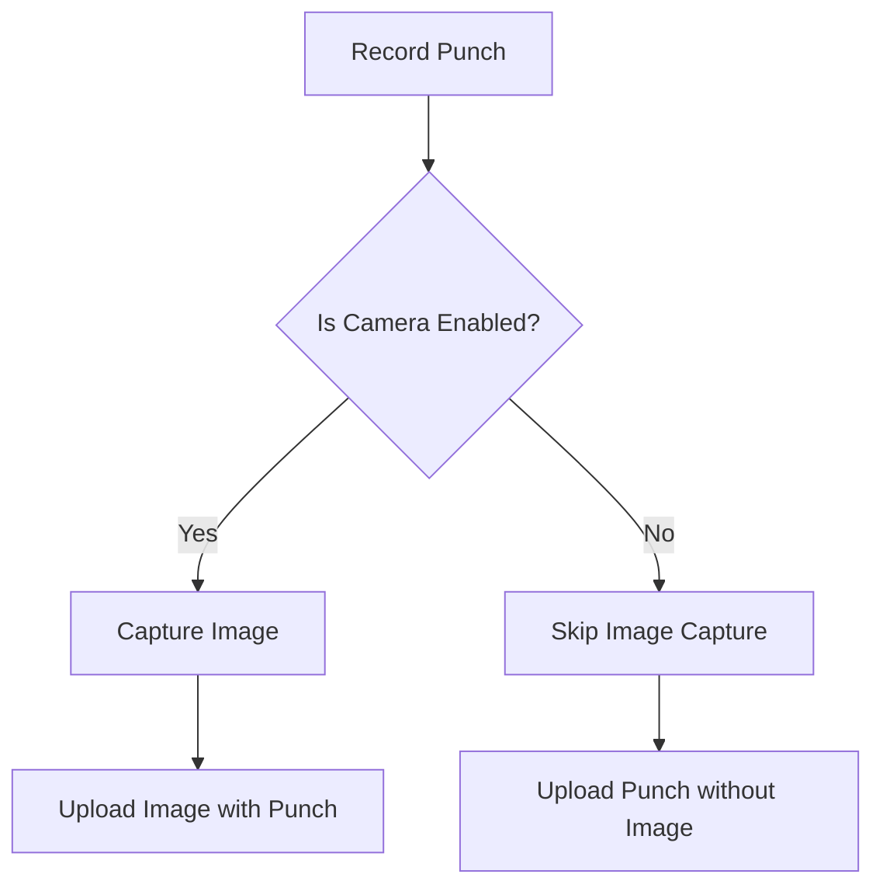

# Camera Toggle Functionality Implementation Plan

## Overview

We need to add an option to enable or disable the camera functionality in the MSI Clock application. When disabled, the app will:

1. Skip camera initialization to save resources
2. Replace the camera preview with a user-selected image
3. Not capture or upload images with punch information

## Required Changes

### 1. Settings Model and Storage

First, we need to add the camera settings to the application's configuration:

#### Implementation Details:

- Add a new `cameraSettings` section to the settings JSON structure
- Create methods to update and retrieve camera settings
- Default camera to enabled (true)
- Store the selected image path when camera is disabled

### 2. Admin Panel UI Changes

Add a toggle switch and conditional image selection UI to the admin panel:

#### Implementation Details:

- Add a "Camera Settings" section to the admin screen
- Add a toggle switch for enabling/disabling the camera
- Add an image selection button that **only appears when camera is disabled**
- Add a preview of the currently selected image (only visible when camera is disabled)
- Use conditional rendering to show/hide image selection controls based on camera toggle state
- Save settings when changes are made

### 3. Camera Initialization Logic

Modify the camera initialization logic to check if the camera is enabled:

#### Implementation Details:

- Modify `PunchProvider` and `PunchService` to check camera enabled setting
- Skip camera initialization when disabled
- Load the selected image when camera is disabled

### 4. Camera Preview UI Changes

Update the camera preview UI to show the selected image when camera is disabled:

#### Implementation Details:

- Modify the camera preview widget in `ClockScreen` to check camera enabled setting
- Display the selected image when camera is disabled
- When no custom image is selected, use the main MSI logo ('assets/images/msi_logo.png') as the default placeholder
- Ensure the logo is properly sized and centered in the camera preview area

### 5. Punch Recording Logic

Update the punch recording logic to skip image capture when camera is disabled:

#### Implementation Details:

- Modify `recordPunch` method in `PunchService` to check camera enabled setting
- Skip image capture and upload when camera is disabled

## File Changes

1. **lib/services/settings_service.dart**

   - Add methods for camera settings management
   - Update settings structure to include camera settings

2. **lib/screens/admin_screen.dart**

   - Add camera settings section with toggle switch
   - Add image selection functionality that only appears when camera is disabled
   - Add image preview that only appears when camera is disabled

3. **lib/providers/punch_provider.dart**

   - Update to check camera enabled setting
   - Add methods to access camera settings

4. **lib/services/punch_service.dart**

   - Modify camera initialization to check enabled setting
   - Update punch recording to skip image capture when disabled

5. **lib/main.dart**
   - Update camera preview in `ClockScreen` to show selected image when camera disabled
   - Use MSI logo as default placeholder when no custom image is selected

## Implementation Approach

1. First, implement the settings model and storage changes
2. Then, update the admin panel UI to include the new settings
3. Next, modify the camera initialization logic
4. Update the camera preview UI
5. Finally, update the punch recording logic

This approach ensures that each component is properly updated to handle the new camera toggle functionality.

## Testing Plan

1. Test camera enabled (default):

   - Verify camera initializes correctly
   - Verify camera preview shows
   - Verify images are captured and uploaded with punches

2. Test camera disabled:

   - Verify camera does not initialize
   - Verify selected image is shown instead of camera preview
   - Verify MSI logo appears when no custom image is selected
   - Verify punches are recorded without images

3. Test image selection:

   - Verify users can select images from device storage
   - Verify selected image is displayed correctly
   - Verify selected image is remembered between app restarts

4. Test toggling camera:
   - Verify toggling camera on/off works correctly
   - Verify UI updates appropriately when toggled
   - Verify image selection controls only appear when camera is disabled
