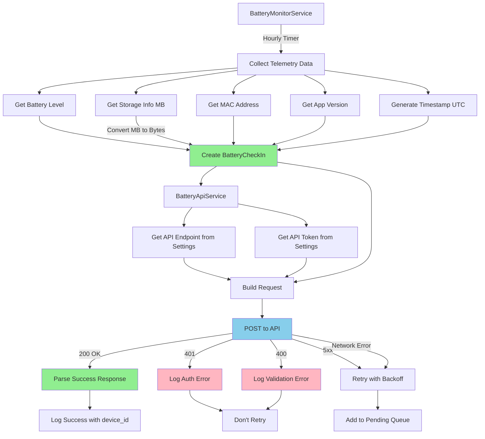
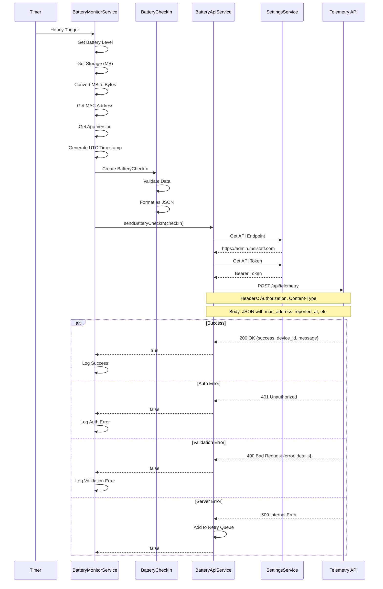

# Telemetry API Migration Plan

## Overview

This plan outlines the migration from the old battery monitoring API to the new unified telemetry API as specified in [`docs/TABLET-INTEGRATION.md`](../docs/TABLET-INTEGRATION.md:1).

## Current State Analysis

### Old API Implementation

**Endpoint:**

- Old: `https://battery-monitor-api.onrender.com/checkin`
- Configurable via settings

**Authentication:**

- None (no authentication headers)

**Payload Format:**

```json
{
  "device_name": "MSI-Tablet",
  "location": "Main Office",
  "battery_pct": 85,
  "mac_address": "AA:BB:CC:DD:EE:FF",
  "free_space_gb": 5.0,
  "total_space_gb": 15.0,
  "free_space_pct": 33,
  "app_version": "1.0.5+6"
}
```

**Key Characteristics:**

- Storage values in GB (gigabytes)
- No timestamp field (server-side timestamp assumed)
- No authentication required
- Single configurable endpoint

### New API Requirements

**Endpoint:**

- Production: `https://admin.msistaff.com/api/telemetry`
- Development: `http://localhost:3000/api/telemetry`

**Authentication:**

- Bearer Token: `a49755e6-4445-4731-b349-60fd1e41b88f`
- Header: `Authorization: Bearer <token>`

**Payload Format:**

```json
{
  "mac_address": "AA:BB:CC:DD:EE:FF",
  "device_name": "Lobby Tablet",
  "location": "Main Office - Lobby",
  "reported_at": "2026-03-04T01:00:00Z",
  "battery_pct": 85,
  "free_space": 5580800000,
  "total_space": 32000000000,
  "app_version": "1.2.3"
}
```

**Key Changes:**

1. **Required Fields:**
   - `mac_address` (required, was optional)
   - `reported_at` (required, new field - ISO-8601 timestamp)

2. **Storage Format:**
   - Old: `free_space_gb` / `total_space_gb` (GB as double)
   - New: `free_space` / `total_space` (bytes as integer)
   - Removed: `free_space_pct` (calculated server-side)

3. **Authentication:**
   - New: Bearer token required in Authorization header

4. **Response Format:**
   - Success (200): `{"success": true, "device_id": "uuid", "message": "Telemetry recorded"}`
   - Error (401): `{"success": false, "error": "Unauthorized"}`
   - Error (400): `{"success": false, "error": "Invalid payload", "details": [...]}`

## Migration Strategy

### Phase 1: Model Updates

#### 1.1 Update [`lib/models/battery_check_in.dart`](../lib/models/battery_check_in.dart:1)

**Changes Required:**

- Add `reportedAt` field (DateTime, required)
- Change `freeSpaceGB` → `freeSpace` (int, bytes)
- Change `totalSpaceGB` → `totalSpace` (int, bytes)
- Remove `freeSpacePct` (no longer sent to API)
- Make `macAddress` required (not nullable)
- Update `toJson()` method to match new schema
- Update field names in JSON serialization

**Conversion Logic:**

```dart
// GB to bytes conversion
int freeSpaceBytes = (freeSpaceGB * 1024 * 1024 * 1024).toInt();
int totalSpaceBytes = (totalSpaceGB * 1024 * 1024 * 1024).toInt();
```

### Phase 2: Service Updates

#### 2.1 Update [`lib/services/battery_api_service.dart`](../lib/services/battery_api_service.dart:1)

**Changes Required:**

1. Update endpoint construction:
   - Change from `$apiEndpoint/checkin` to `$apiEndpoint/api/telemetry`
   - Or make endpoint fully configurable

2. Add authentication:
   - Add `Authorization: Bearer <token>` header
   - Get token from settings service

3. Update request headers:

   ```dart
   headers: {
     'Content-Type': 'application/json',
     'Authorization': 'Bearer $apiToken',
   }
   ```

4. Update response handling:
   - Parse new success response format
   - Handle new error response formats (401, 400 with details)
   - Log `device_id` from successful responses

5. Update retry logic:
   - Don't retry 4xx errors (except network issues)
   - Retry 5xx errors with exponential backoff

#### 2.2 Update [`lib/services/battery_monitor_service.dart`](../lib/services/battery_monitor_service.dart:1)

**Changes Required:**

1. Add timestamp generation:

   ```dart
   final reportedAt = DateTime.now().toUtc();
   ```

2. Update storage metrics conversion:

   ```dart
   // Convert MB to bytes (not GB)
   final freeSpaceBytes = freeSpaceMB != null
     ? (freeSpaceMB * 1024 * 1024).toInt()
     : null;
   final totalSpaceBytes = totalSpaceMB != null
     ? (totalSpaceMB * 1024 * 1024).toInt()
     : null;
   ```

3. Ensure MAC address is always available:
   - Add validation/error handling if MAC address is null
   - Log warning if MAC address cannot be obtained

4. Update BatteryCheckIn instantiation:

   ```dart
   final checkIn = BatteryCheckIn(
     macAddress: macAddress!, // Now required
     deviceName: deviceName,
     location: location,
     reportedAt: reportedAt,
     batteryPct: batteryPct,
     freeSpace: freeSpaceBytes,
     totalSpace: totalSpaceBytes,
     appVersion: appVersion,
   );
   ```

5. Update logging to show bytes or convert for display

#### 2.3 Update [`lib/services/settings_service.dart`](../lib/services/settings_service.dart:1)

**Changes Required:**

1. Add new settings fields:
   - `batteryApiToken` (default: `a49755e6-4445-4731-b349-60fd1e41b88f`)
   - Update default endpoint to `https://admin.msistaff.com`

2. Add getter methods:

   ```dart
   Future<String> getBatteryApiToken() async {
     final settings = await getSettings();
     if (settings['battery'] is Map<String, dynamic> &&
         settings['battery']['apiToken'] is String) {
       return settings['battery']['apiToken'] as String;
     }
     return 'a49755e6-4445-4731-b349-60fd1e41b88f';
   }
   ```

3. Add setter methods:

   ```dart
   Future<void> updateBatteryApiSettings({
     String? apiEndpoint,
     String? apiToken,
   }) async {
     // Update battery settings with new fields
   }
   ```

4. Update default battery settings structure:
   ```dart
   'battery': {
     'apiEndpoint': 'https://admin.msistaff.com',
     'apiToken': 'a49755e6-4445-4731-b349-60fd1e41b88f',
     'deviceName': 'MSI-Tablet',
     'location': '',
   }
   ```

### Phase 3: UI Updates

#### 3.1 Update [`lib/screens/admin_screen.dart`](../lib/screens/admin_screen.dart:1)

**Changes Required:**

1. Add API token field:
   - Add `TextEditingController _batteryApiTokenController`
   - Add text field in battery settings section
   - Load/save token with other battery settings

2. Update default endpoint hint text:
   - Change from `https://battery-monitor-api.onrender.com`
   - To `https://admin.msistaff.com`

3. Add validation:
   - Validate endpoint format
   - Validate token format (UUID)

4. Update save logic:
   ```dart
   await _settingsService.updateBatteryApiSettings(
     apiEndpoint: _batteryApiEndpointController.text,
     apiToken: _batteryApiTokenController.text,
   );
   ```

### Phase 4: Error Handling & Validation

#### 4.1 Add Validation in [`lib/models/battery_check_in.dart`](../lib/models/battery_check_in.dart:1)

**Validations:**

1. MAC address format validation:

   ```dart
   static bool isValidMacAddress(String mac) {
     final regex = RegExp(r'^([0-9A-Fa-f]{2}[:-]){5}([0-9A-Fa-f]{2})$');
     return regex.hasMatch(mac);
   }
   ```

2. Timestamp validation:
   - Ensure timestamp is in UTC
   - Format as ISO-8601

3. Battery percentage validation:
   - Ensure 0-100 range

4. Storage validation:
   - Ensure positive integers

#### 4.2 Enhanced Error Handling in [`lib/services/battery_api_service.dart`](../lib/services/battery_api_service.dart:1)

**Error Scenarios:**

1. **401 Unauthorized:**
   - Log error with clear message about authentication
   - Don't retry (configuration issue)

2. **400 Bad Request:**
   - Parse error details from response
   - Log specific validation failures
   - Don't retry (data issue)

3. **500 Server Error:**
   - Log error
   - Retry with exponential backoff

4. **Network Errors:**
   - Log error
   - Retry with exponential backoff

### Phase 5: Testing Strategy

#### 5.1 Unit Tests

**Test Cases:**

1. Model serialization/deserialization
2. Storage conversion (GB → bytes)
3. MAC address validation
4. Timestamp formatting
5. Error response parsing

#### 5.2 Integration Tests

**Test Scenarios:**

1. Successful telemetry submission
2. Authentication failure (invalid token)
3. Validation failure (invalid MAC address)
4. Network failure and retry logic
5. Server error and retry logic

#### 5.3 Manual Testing

**Test Steps:**

1. Configure new API endpoint in admin settings
2. Configure API token in admin settings
3. Trigger manual battery report
4. Verify data appears in new dashboard
5. Test with invalid token (should get 401)
6. Test with invalid MAC address (should get 400)
7. Monitor logs for proper error handling

### Phase 6: Documentation Updates

#### 6.1 Update [`docs/storage_monitoring_battery_checkin.md`](../docs/storage_monitoring_battery_checkin.md:1)

**Updates:**

- Document new API endpoint
- Document authentication requirements
- Update payload examples
- Update field descriptions (bytes vs GB)
- Add troubleshooting section

#### 6.2 Create Migration Guide

**Document:**

- Breaking changes
- Configuration updates needed
- How to test the migration
- Rollback procedure if needed

## Implementation Checklist

### Critical Path Items

- [ ] **Update BatteryCheckIn model**
  - [ ] Add `reportedAt` field (DateTime, required)
  - [ ] Change storage fields to bytes (int)
  - [ ] Make `macAddress` required
  - [ ] Update `toJson()` method
  - [ ] Add validation methods

- [ ] **Update BatteryApiService**
  - [ ] Update endpoint construction
  - [ ] Add Bearer token authentication
  - [ ] Update response parsing
  - [ ] Enhance error handling
  - [ ] Update retry logic

- [ ] **Update BatteryMonitorService**
  - [ ] Add timestamp generation
  - [ ] Update storage conversion (MB → bytes)
  - [ ] Ensure MAC address is available
  - [ ] Update BatteryCheckIn instantiation
  - [ ] Update logging

- [ ] **Update SettingsService**
  - [ ] Add API token field
  - [ ] Update default endpoint
  - [ ] Add getter/setter for token
  - [ ] Update battery settings structure

- [ ] **Update Admin Screen**
  - [ ] Add API token input field
  - [ ] Update default endpoint hint
  - [ ] Add validation
  - [ ] Update save logic

### Testing Items

- [ ] Test successful telemetry submission
- [ ] Test authentication failure handling
- [ ] Test validation error handling
- [ ] Test network error retry logic
- [ ] Test MAC address retrieval
- [ ] Test storage conversion accuracy
- [ ] Test timestamp formatting

### Documentation Items

- [ ] Update storage monitoring documentation
- [ ] Create migration guide
- [ ] Update CHANGELOG.md
- [ ] Add inline code comments for new logic

## Risk Assessment

### High Risk Items

1. **MAC Address Requirement:**
   - **Risk:** MAC address might not be available on all devices
   - **Mitigation:** Add fallback to Android ID, add error handling

2. **Storage Conversion:**
   - **Risk:** Integer overflow for large storage values
   - **Mitigation:** Use 64-bit integers, validate conversions

3. **Authentication:**
   - **Risk:** Hardcoded token in settings could be security concern
   - **Mitigation:** Document that token should be stored securely, consider encryption

### Medium Risk Items

1. **Timestamp Synchronization:**
   - **Risk:** Device clock might be incorrect
   - **Mitigation:** Use UTC, document importance of time sync

2. **Backward Compatibility:**
   - **Risk:** Old API might still be in use during transition
   - **Mitigation:** Make endpoint/token configurable, test both APIs

## Rollback Plan

If issues are discovered after deployment:

1. **Quick Rollback:**
   - Change API endpoint back to old URL in admin settings
   - Old payload format should still work with old API

2. **Code Rollback:**
   - Revert to previous version via Git
   - Redeploy previous APK

3. **Data Considerations:**
   - New API should be backward compatible
   - Old data format should be rejected gracefully

## Timeline Considerations

### Development Phases

1. **Phase 1-2 (Model & Service Updates):** Core implementation
2. **Phase 3 (UI Updates):** User-facing changes
3. **Phase 4 (Error Handling):** Robustness improvements
4. **Phase 5 (Testing):** Validation and quality assurance
5. **Phase 6 (Documentation):** Knowledge transfer

### Dependencies

- No external dependencies required
- All changes are internal to the app
- New API must be available for testing

## Success Criteria

1. ✅ Telemetry data successfully sent to new API
2. ✅ Authentication working correctly
3. ✅ Storage values converted accurately (bytes)
4. ✅ Timestamps in correct ISO-8601 format
5. ✅ MAC address always included
6. ✅ Error handling for all failure scenarios
7. ✅ Admin UI allows configuration of endpoint and token
8. ✅ Logs provide clear debugging information
9. ✅ Documentation updated and accurate
10. ✅ No data loss during migration

## Key Differences Summary

| Aspect             | Old API        | New API                   |
| ------------------ | -------------- | ------------------------- |
| **Endpoint**       | `/checkin`     | `/api/telemetry`          |
| **Authentication** | None           | Bearer Token              |
| **Storage Units**  | GB (double)    | Bytes (integer)           |
| **Timestamp**      | Server-side    | Client-side (required)    |
| **MAC Address**    | Optional       | Required                  |
| **Free Space %**   | Sent by client | Calculated by server      |
| **Response**       | Simple         | Structured with device_id |

## Architecture Diagram



## Data Flow Diagram



## Configuration Changes

### Before Migration

```json
{
  "battery": {
    "apiEndpoint": "https://battery-monitor-api.onrender.com",
    "deviceName": "MSI-Tablet",
    "location": "Main Office"
  }
}
```

### After Migration

```json
{
  "battery": {
    "apiEndpoint": "https://admin.msistaff.com",
    "apiToken": "a49755e6-4445-4731-b349-60fd1e41b88f",
    "deviceName": "MSI-Tablet",
    "location": "Main Office"
  }
}
```

## Notes

- The new API uses a single shared token across all tablets
- Storage values must be in bytes (not GB) - this is a critical change
- MAC address is now required - ensure it's always available
- Timestamp must be client-generated in ISO-8601 UTC format
- The server calculates storage percentage, so we don't send it
- Error responses are more detailed and structured
- The API returns a `device_id` which could be stored for future use

---

**Document Version:** 1.0  
**Created:** 2026-03-04  
**Author:** Roo (Architect Mode)
